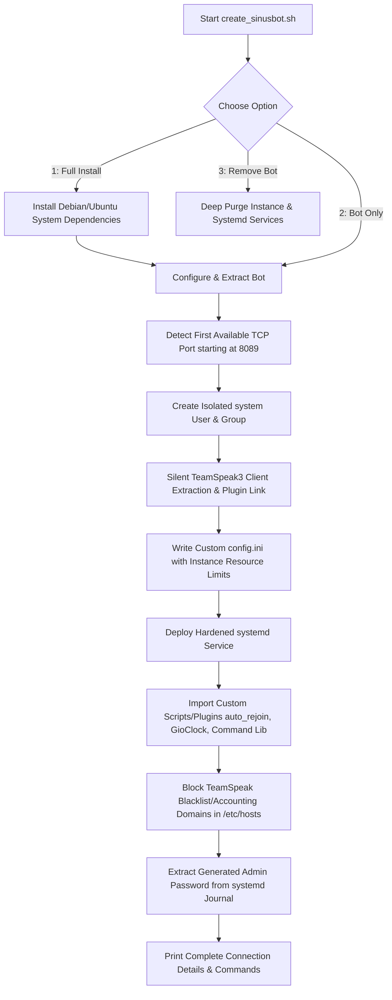

<h1 align="center">
  🎵 SinusBot Multi-Instance Suite
</h1>

<p align="center">
  <b>Unleash the full power of SinusBot. Deploy, manage, and scale multiple fully-isolated instances with zero hassle.</b><br>
  A production-ready Bash suite designed for Debian & Ubuntu that streamlines multi-instance automation, firewall orchestration, network protection, and advanced bot configurations.
</p>

<p align="center">
  
  
  
  
</p>

---

## 🧠 Behind the Scenes: How It Works

Managing multiple SinusBot instances manually is complex, error-prone, and presents permission risks. This suite completely automates the lifecycle of your bots using strict security and system practices:



1. **Strict User Isolation**: Every bot runs under its own dedicated system user and group (e.g., `sinusbot2:sinusbot2`) with no login shell `/bin/false`. This ensures a breach in one instance cannot access another bot or compromise the host system.
2. **Smart Port Allocation**: It automatically scans the host system using `ss` (Socket Statistics) to find the first unused TCP port starting from `8089`, eliminating port collision issues.
3. **Automated TeamSpeak 3 Setup**: It performs a silent extraction of the TeamSpeak 3 Client, injects the SinusBot communication plugin directly into the client plugins folder, and links everything together inside `/opt/<botname>`.
4. **Hardened systemd Management**: Each bot runs as a standard, individual systemd service with tailored resource controls (`LimitNOFILE=512000`, `LimitNPROC=512000`) and private temp folder allocation (`PrivateTmp=true`).
5. **Anti-Blacklist Protection**: Modifies your server's `/etc/hosts` file to block known TeamSpeak reporting and update domains, preventing instances from being blacklisted.

---

## ✨ Features

- ⚡ **Seamless Multi-Instance ready** – Run dozens of independent bots on a single VPS or dedicated server.
- 🛠️ **Full-Stack Automation** – Interactive wizard installs core Debian/Ubuntu packages, extracts the TS3 client, and initializes the bot automatically.
- 🧹 **Graceful Purge / Uninstaller** – Stop, disable, delete user, home directories, configuration, and data folders cleanly with option #3.
- 🛡️ **Firewall Orchestrated** – Checks if `ufw` is active and automatically opens the designated port.
- ⚙️ **Configurable Limits** – Set maximum concurrent instances directly inside the installer prompt.
- 📦 **Pre-loaded Advanced Plugins** – Automatically copies customized Javascript scripts (anti-flood, digital clock, command library) from your local `./scripts` directory directly into the new bot instance.
- 🔐 **Zero-Config Password Retrieval** – Dynamically parses the boot logs via systemd `journalctl` to extract the generated admin password and output it upon installation.

---

## 📋 Prerequisites & Workspace Preparation

### System Specifications
* **Operating System**: Debian 10+ or Ubuntu 18.04+ (APT-based Linux distributions)
* **User Privileges**: **root** access is required to manage users, write to `/opt/`, modify firewall rules, and register systemd services.
* **Core Utilities**: `tar`, `curl`, `useradd`, and `systemctl`.

### Directory Layout
Before running the script, make sure your installation directory is organized. Place the installer script, the script plugins, and the binary archives in the same workspace folder:

```text
~/sinusbot-installer/
├── create_sinusbot.sh                     # This multi-instance manager script
├── sinusbot.current.tar.bz2               # SinusBot binary archive
├── TeamSpeak3-Client-linux_amd64-3.5.6.run # TS3 Client binary runner
└── scripts/                               # Folder containing custom plugins
    ├── GioClock-v3.0.js
    ├── auto_rejoin.js
    └── command.js
```

> 💡 **Downloads**: Download SinusBot from [sinusbot.com](https://www.sinusbot.com/) and the TS3 Client from [teamspeak.com](https://www.teamspeak.com/).

---

## 🚀 Step-by-Step Usage Guide

### 1️⃣ Launch the Interactive CLI
Execute the script as **root**:
```bash
sudo chmod +x create_sinusbot.sh
sudo ./create_sinusbot.sh
```

You will be greeted by the interactive **SinusBot Multi-Instance Manager CLI Menu**:
```text
==============================================
  SinusBot Multi-Instance Manager
==============================================
  1) Full install (system packages + bot)
  2) Install bot only (skip system packages)
  3) Remove an existing bot
==============================================
Enter your choice [1-3]:
```

---

### 2️⃣ Understanding Menu Options

#### 🔹 Option 1: Full Install (Highly Recommended for Clean Servers)
Installs essential system dependencies required for SinusBot to run headless, configure audio, and boot. 
* **Installs**: Headless graphics layers (`xvfb`, `libfontconfig`, `libxtst6`, `libxcursor1`, `libnss3`, `libegl1-mesa-dev`, `libxkbcommon0`, `libxss1`), SSL certificates, compressed archive extractors, network utilities, etc.
* **Next step**: Moves automatically to prompt you for a **Bot Name** (e.g., `sinusbot1`), **Maximum instances** (default is unlimited), extracts files, sets up systemd, copies the script plugins, blocks tracking hosts, and launches the service.

#### 🔹 Option 2: Install Bot Only
Ideal if you already ran Option 1 on this server once and just want to spawn a second, third, or N-th bot instance.
* Skips installing system packages to save time.
* Prompts for a unique **Bot Name** (e.g., `sinusbot2`), sets up its custom directory in `/opt/sinusbot2`, automatically binds a free port (e.g., `8090`), and initiates the instance.

#### 🔹 Option 3: Remove an Existing Bot (Purge)
Dismantles any bot instance safely without leaving traces behind:
1. Prompts you for the exact bot name (e.g., `sinusbot2`).
2. Stops and disables the systemd service.
3. Deletes the `/etc/systemd/system/<botname>.service` file and reloads systemd.
4. Deletes the dedicated system user and their home folder (`userdel -r`).
5. Completely deletes the `/opt/<botname>` installation folder.

---

## 📦 Bundled Advanced Custom Plugins

This repository comes pre-packaged with 3 advanced Javascript plugins that will automatically copy into every newly created SinusBot instance during installation:

### 🕒 1. GioClock-v3.0 (`scripts/GioClock-v3.0.js`)
An impressive digital clock that displays dates and times directly as TeamSpeak 3 channel names.
* **ASCII Art Clock**: Draws custom large block numbers (using filled ASCII chars) on special spacer channels for a gorgeous live dashboard look.
* **Highly Customizable**: Supports 24-hour and 12-hour AM/PM formats, dozens of time zones, and multiple date layouts (`DD.MM.YYYY`, `YYYY.MM.DD`, etc.).
* **Auto-cycling Developer Notice**: Toggles credit displays to maintain channel updates and keep them fresh.

### 🛡️ 2. Auto Rejoin (Anti-Flood) (`scripts/auto_rejoin.js`)
Prevents your bot from being disconnected forever if the server restarts or undergoes a flood attack.
* **Smart Intervals**: Utilizes random connection offset intervals (up to 15 seconds) so that multiple bots don't hit the TeamSpeak server at the exact same millisecond (bypassing connection flood limits).
* **Automated Connection Monitor**: Runs a background check loop every 30 seconds; if connection is lost, it automatically commands the backend to reconnect.

### 🔌 3. Command Library (`scripts/command.js`)
A highly sophisticated backend helper designed by Multivitamin to facilitate text-based chat commands.
* **Multi-Backend**: Out-of-the-box support for both **TeamSpeak 3** and **Discord** bot commands.
* **Security & Control**: Includes integrated user permissions, throttling protection (prevents spam and abuse), and strict type validation (e.g. validating string, number, client objects, or grouped arguments).

---

## ⚙️ Advanced Configurations & System Integration

### 📋 systemd Service Controls
Once installed, your bots are registered as system services. You can manage them like any standard Linux daemon. Replace `<botname>` with your actual bot instance name (e.g., `sinusbot1`):

```bash
# Check the status of your bot
systemctl status <botname>

# Start the bot
systemctl start <botname>

# Stop the bot
systemctl stop <botname>

# Restart the bot
systemctl restart <botname>

# View real-time logs from the bot (extremely useful for debugging)
journalctl -u <botname> -f
```

### 🔒 Retrieve Admin Password Manually
If you missed the installation complete output, you can query systemd's logs to retrieve the auto-generated password of your instance:
```bash
journalctl -u <botname> --no-pager | grep -oP "account 'admin' and password '\K[^']+"
```

### 🚫 Blocked TeamSpeak Blacklist/Accounting Domains
To secure the bot environment, the installer appends the following redirects to `/etc/hosts` to point them to `127.0.0.1`:
* `weblist.teamspeak.com` & `abuse.teamspeak.com`
* `teamspeak.org` & `www.teamspeak.org`
* `accounting.teamspeak.com` & `blacklist.teamspeak.com`
* `ipcheck.teamspeak.com` & `blacklist2.teamspeak.com` & `greylist.teamspeak.com`

---

## 🛡️ License & Contributing

This project is open-source and licensed under the [MIT License](LICENSE). Contributions, bug reports, and suggestions are welcome. Feel free to open issues or submit pull requests to improve the installer bash logic or update custom JS plugins!
